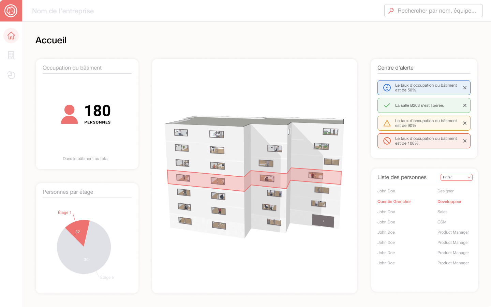
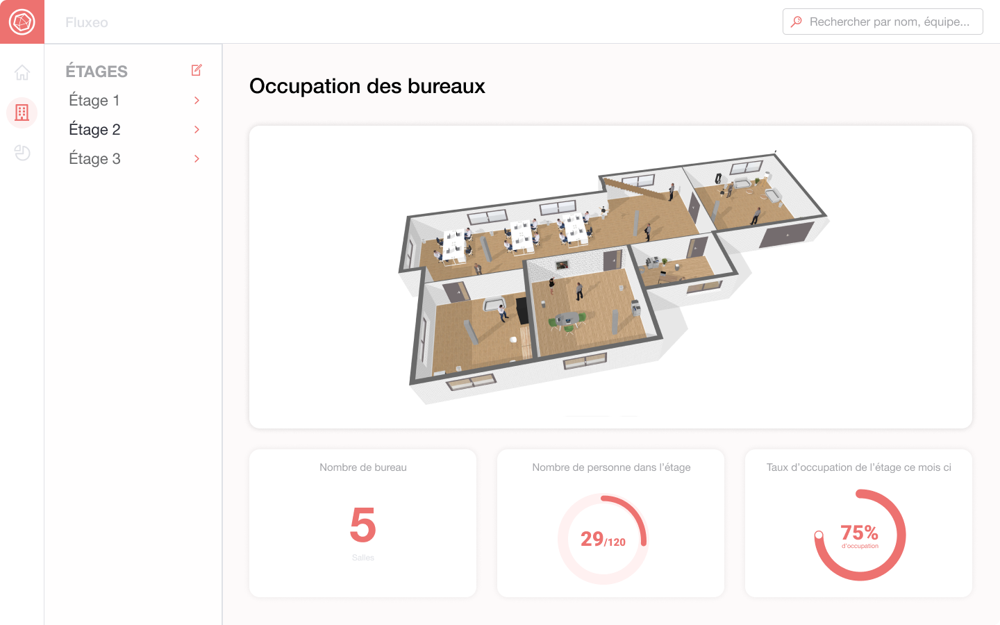
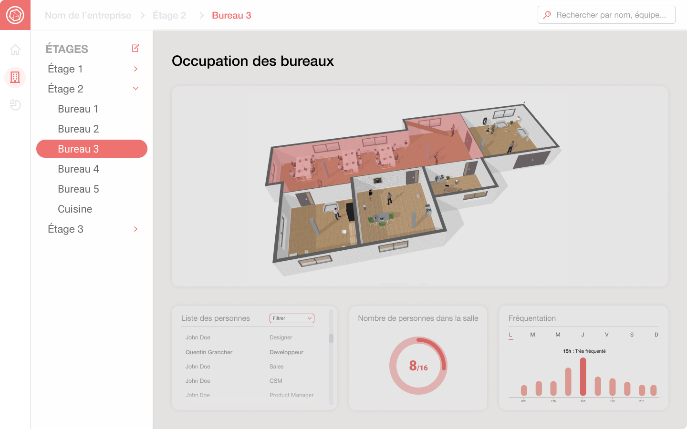

# Fluxeo - Smart Building and IOT

## 🎓 Disclaimer

This site has been created for educational purposes as part of the Bachelor's curriculum of the HETIC school. 
**This proof of concept was made using demo data that is no longer accessible. This data was provided by intelligent sensors that simulated the detection of people in a building. So the application is currently out of service.**


## 🌐 Project Overview
<p align="center">
  
  
  
  
  
</p>


**Fluxeo** is a smart building application. Thanks to a system of detection of people within the floors and the different rooms, Fluxeo allows a better management of a building at the level of profitability, security, organization and sanitary. It's a Next.js project bootstrapped with `create-next-app` and using TypeScript. It's deployed on Vercel Platform.

Time to dev: **8 days**

## 🚀 Getting Started

### Live demo

Website is deployed [here](https://fluxeo.vercel.app/).(🚧)\
Mobile Prototype is [here](https://www.figma.com/proto/NwgiGn4kpUHqgpgCQ47lzQ/IOT?page-id=271%3A6733&node-id=271%3A8676&viewport=789%2C78%2C0.31785428524017334&scaling=scale-down)

### Installing

Clone the repository, and install the dependancies.

```
git clone $url
```

```
cd si-fluxeo-iot
```

```
npm install
```

### Development Mode

```
npm run dev
```

Run the app in development mode.\
Open [http://localhost:3000/](http://localhost:3000/) to view it in the browser.\
You can start editing the page by modifying `pages/index.js`. The page auto-updates as you edit the file.

### Production Mode

```
npm run build
```

Builds the app for production to the build folder.\
The build is minified and the filenames include the hashes.\
Your app is ready to be deployed.

## 🔨 Built with

Nextjs - [documentation](https://nextjs.org/)\
Reactjs - [documentation](https://reactjs.org/)\
Typescript - [documentation](https://www.typescriptlang.org/docs/)\

## 🎨 Styling with

Sass - [documentation](https://sass-lang.com/documentation/)\
Classnames - [classnames](https://www.npmjs.com/package/classnames)\
CSS Modules - [css modules](https://create-react-app.dev/docs/adding-a-css-modules-stylesheet)

## 👥 Contributers

Bastien Paquier - [bastien17-dev](https://github.com/bastien17-dev)\
Quentin Trouvé - [quentintrouve](https://github.com/quentintrouve)\
Quentin Grancher - [quentingrchr](https://github.com/quentingrchr)
